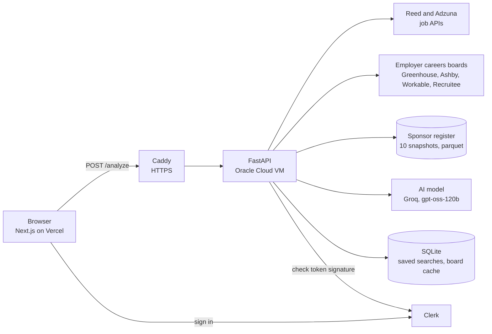

# Threshold

[](https://github.com/dakshkumar96/Threshold/actions/workflows/ci.yml)

Threshold helps international students in the UK find jobs that can actually sponsor a Skilled Worker visa.

You type a role. It pulls live job ads from Reed, Adzuna and some employers' own careers boards. Each employer gets checked against the Home Office list of licensed sponsors. Sponsors are ranked by how long they have held their licence. If you upload a CV, you also get a skill match against the ads and a written review from an AI model. The review's claims are checked against your CV.

The live site is at https://threshold-omega-jet.vercel.app

I built it because I'm an international student too. Working out whether an employer can sponsor you is slow and mostly guesswork.

## What it does

- **Sponsor check on every ad.** Each employer is matched to the [Home Office register](https://www.gov.uk/government/publications/register-of-licensed-sponsors-workers). The 28 July 2026 edition has 121,199 licensed sponsors. Every match is labelled verified, likely or possible, so the site never claims more than it knows.
- **Licence stability.** I keep ten snapshots of the register going back to 2023. They show how long each sponsor has held its licence. A survival model (Kaplan-Meier and Cox, using `lifelines`) ranks sponsors by how likely they are to keep it.
- **Skills from real ads.** It counts the skills employers ask for across all the ads for a role. Then it compares them with your CV.
- **A checked AI review.** The model judges each top skill from your CV. A claim like "the CV shows this skill" only counts if the quote it gives is really in the CV.

## How it works



One search goes through these steps. The code is in `api/analysis.py`.

1. Read the CV. It can be a PDF or text, up to 5 MB, 10 pages and 80,000 characters.
2. Work out the candidate's level from the CV, or use the level they picked.
3. Search Reed and Adzuna at the same time. Run a second search for the level, like "graduate data analyst". Fetch full descriptions for the top Reed ads.
4. Match each employer to the register by name. Then run an identity check on the match. Employers on a known careers board are added as verified ads.
5. Count the skills across the ads and score the CV against them.
6. If there is a CV, ask the AI for a review. Check its claims against the CV and fix contradictions in code.
7. Send everything back as one JSON answer. In the background, look for careers boards for new sponsors so the next search can use them.

## Decisions worth explaining

- **Confidence levels, not yes or no.** Name matching is hard. A short name like "Wise" matches more than 40 register entries equally well. I checked 100 matches by hand and 59% were right. So name matches show as "likely" or "possible" and never as certain. Only ads from an employer's own careers board are "verified". [ACCURACY.md](ACCURACY.md) has the details.
- **A company that left the register is never shown as a sponsor.** The data holds every company seen since 2023, which is 133,979. Only the 121,199 on the latest register can sponsor today.
- **The AI is checked, not trusted.** Evidence quotes are matched against the CV text. If the AI says "ready to send" next to a low score, the code overrules it. A gap that is also listed as a strength gets dropped. The temperature is low and the seed is fixed, so the same CV gets the same review.
- **Built for a free AI tier.** Groq's free tier allows about 8,000 tokens a minute and one review uses most of that. So the prompt stays under 17,000 characters. The model reads the first 4,500 characters of a long CV. The site says so when that happens. The keyword match always uses the whole CV.
- **Refactors are checked against a recording.** `tests/golden/` replays 72 API requests with every network call faked. It compares the answers, the exact prompt sent to the AI and every cache write with a saved recording. I restructured the code several times with this passing at every step.
- **Security basics.** Sign-in tokens only count if the configured Clerk instance signed them. Error messages never include addresses or API keys. Requests are rate limited per address. Uploads, pages and text are capped. A search gets a clear "busy" message when the small server is already running two.

## Running it locally

You need Python 3.12 or newer and Node.js 22. Production runs Python 3.13.

### 1. The API

On macOS or Linux:

```bash
python3 -m venv .venv
source .venv/bin/activate
pip install -r requirements-dev.txt
```

On Windows (PowerShell):

```powershell
python -m venv .venv
.\.venv\Scripts\Activate.ps1
pip install -r requirements-dev.txt
```

Create a `.env` file in the repo root. Git ignores it.

```
REED_API_KEY=...
ADZUNA_APP_ID=...
ADZUNA_APP_KEY=...

# The AI review. Without it, searches work but CV uploads return 503.
LLM_API_KEY=...
LLM_BASE_URL=https://api.groq.com/openai/v1
LLM_MODEL=openai/gpt-oss-120b

# Sign-in for saved searches and the profile page.
CLERK_ISSUER=https://your-instance.clerk.accounts.dev

# Only on your own machine. Turns on the /docs pages.
APP_ENV=local
CORS_ALLOW_ORIGINS=http://localhost:3000
```

Start it with the same command on every system.

```bash
python -m uvicorn api.main:app --reload --port 8000
```

`POST /analyze` takes a multipart form. `role` is required and `cv_file` is an optional PDF or TXT. With `APP_ENV=local` the interactive docs are at http://127.0.0.1:8000/docs. [deploy/.env.example](deploy/.env.example) describes every setting.

### 2. The website

On macOS or Linux:

```bash
cd frontend
npm install
cp .env.local.example .env.local
npm run dev
```

On Windows (PowerShell):

```powershell
cd frontend
npm install
copy .env.local.example .env.local
npm run dev
```

Open http://localhost:3000. If `.env.local` has no Clerk keys, Clerk runs in its keyless development mode. Searching works without an account. Only `/home` and `/profile` need you to sign in.

### 3. Rebuilding the data (optional)

The two register files the API reads are committed. They are `data/processed/sponsor_company_summary.parquet` and `data/processed/sponsor_retention_scores.parquet`. To rebuild them with a new register edition, follow these steps.

1. Run `pip install -r requirements-analysis.txt`.
2. Run `python src/download_sponsor_register.py` to download the latest register CSV.
3. Run `notebooks/02_clean_and_panel.ipynb` to rebuild the panel of snapshots and the company summary.
4. Run `python src/survival_prep.py` and then `python src/run_survival.py` to rebuild the stability scores.
5. Update `REGISTER_EDITION` in `frontend/lib/register.ts`. Update the numbers in `frontend/data/insights.json` too.

## Tests

```bash
pytest
python -m tests.golden.record --check
ruff check .
pip-audit -r requirements.txt
```

`pytest` runs 87 tests on sign-in, limits, uploads, key leaks, register status and scoring. The second command checks the 72 recorded API scenarios. CI runs all of this on every push. It also runs a type check and `npm audit` for the website.

## Deployment

- **Website.** Vercel builds it from this repo on every push to `main`.
- **API.** A small Oracle Cloud VM with one ARM CPU. uvicorn runs under systemd on Python 3.13. Caddy sits in front for HTTPS and limits request bodies to 6 MB.

[deploy/README.md](deploy/README.md) covers setup, updates and rollback.

## Known limitations

- **Name matching is about 59% precise.** That's from a hand-checked sample of 100. A short name like "Wise" can match the wrong register entry.
- **A licence is not a job offer.** Being on the register means a company can sponsor. It doesn't mean it will sponsor a given role.
- **I update the register by hand.** The data is the 28 July 2026 edition. Licences granted or removed since then don't show yet.
- **The register has no sector or job information.** Its snapshots are also irregular, so licence tenure is an estimate.
- **Job descriptions are often cut short.** Adzuna only gives a snippet. I fetch full Reed descriptions for the top 30 ads.
- **The AI review is limited by a free tier.** About one review a minute fits in Groq's free allowance. Long CVs are cut to their first 4,500 characters for the review.
- **Sign-in uses a Clerk development instance.** A production instance needs a custom domain.
- **Salary checks use two thresholds.** They are £41,700 for most people and £33,400 for new entrants. The going rate for each occupation isn't checked.
- **Rate limits are counted per server process.** The server runs two workers, so the real limit is twice the setting.

## Data and licences

The sponsor register comes from the Home Office under the [Open Government Licence v3.0](https://www.nationalarchives.gov.uk/doc/open-government-licence/version/3/). Job ads come from the Reed and Adzuna APIs under their own terms. The code is MIT licensed. See [LICENSE](LICENSE).

More background is in [ANALYSIS.md](ANALYSIS.md) for the survival analysis and [ACCURACY.md](ACCURACY.md) for how matching was measured. [docs/stages](docs/stages) shows how the project was built, stage by stage.
