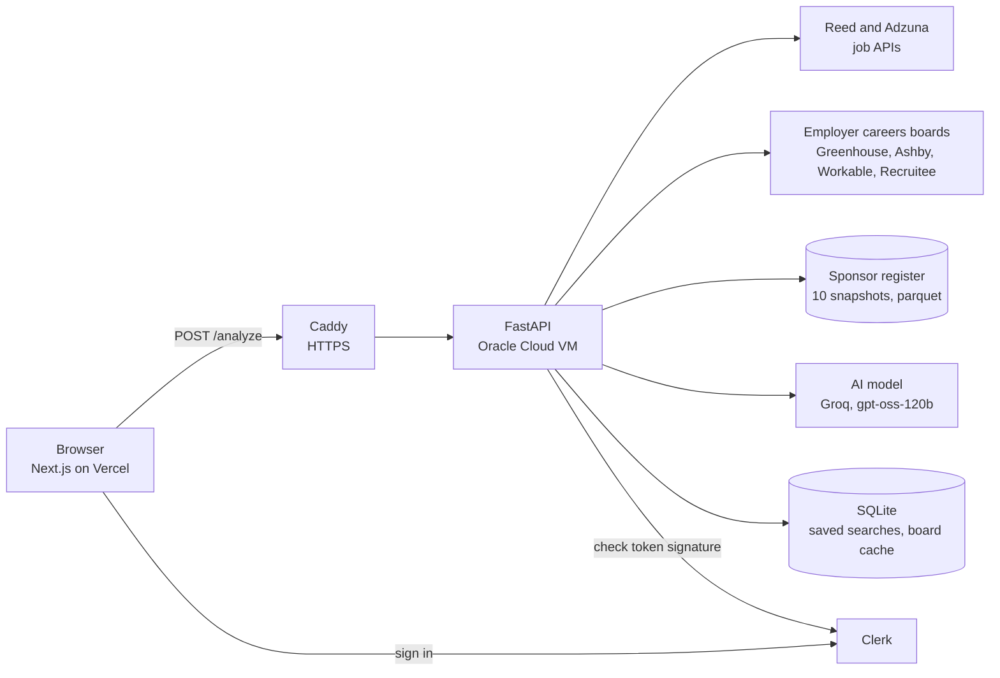

# Threshold

[](https://github.com/dakshkumar96/Threshold/actions/workflows/ci.yml)

Threshold helps international students in the UK find jobs that can actually sponsor a Skilled Worker visa.

Type a role and it pulls live job ads from Reed, Adzuna and employers' own careers boards. Each employer is checked against the Home Office register of licensed sponsors, and the sponsors are ranked by how long they have held their licence. Upload a CV and you also get a skill match against those ads, plus a written review from an AI model whose claims are checked against your CV.

**Live site:** https://threshold-omega-jet.vercel.app

I built it because I am an international student myself, and finding out whether an employer can sponsor you is slow and full of guesswork.

## What it does

- **Sponsor check for every ad.** Each employer is matched to the [Home Office register](https://www.gov.uk/government/publications/register-of-licensed-sponsors-workers) (121,199 licensed sponsors on the 28 July 2026 edition). Every match is labelled verified, likely or possible, so the result never claims more than it knows.
- **Licence stability.** Ten snapshots of the register since 2023 show how long each sponsor has held its licence. A survival model (Kaplan-Meier and Cox, with `lifelines`) ranks sponsors by how likely they are to keep it.
- **Skills from real ads.** The skills employers ask for are counted across all the ads for the role, then compared with the CV.
- **A checked AI review.** The model judges each top skill from the CV, but a claim like "the CV shows this skill" only counts if the quote it gives is really in the CV.

## How it works



One search, step by step (`api/analysis.py`):

1. Read the CV (PDF or text, at most 5 MB, 10 pages and 80,000 characters).
2. Work out the candidate's level from the CV, or use the level they picked.
3. Search Reed and Adzuna at the same time, plus a second search for the level ("graduate data analyst"). Fetch full descriptions for the top Reed ads.
4. Match each employer to the register by name, then confirm the match with an identity check. Employers that publish on a known careers board are added as verified ads.
5. Count the skills across the ads and score the CV against them.
6. With a CV, ask the AI model for a review, then check its claims against the CV and fix contradictions in code.
7. Return everything as one JSON answer. In the background, look for careers boards of new sponsors for next time.

## Decisions worth explaining

- **Honest confidence instead of yes or no.** Name matching is hard (a short name like "Wise" matches more than 40 register entries equally well). A sample of 100 matches was checked by hand and 59% were right, so name matches are shown as "likely" or "possible", never as certain. Only ads from an employer's own careers board are "verified". Details are in [ACCURACY.md](ACCURACY.md).
- **A company that left the register is never shown as a sponsor.** The data keeps every company seen since 2023 (133,979), but only the 121,199 on the latest register can sponsor today.
- **The AI is checked, not trusted.** Evidence quotes are matched against the CV text, a "put forward" verdict that contradicts a low score is overruled, and a gap that is also listed as a strength is dropped. The temperature is low and the seed is fixed, so the same CV gets the same review.
- **Built for a free AI tier.** Groq's free tier allows about 8,000 tokens a minute, and one review uses most of that. The prompt is kept under 16,000 characters, so the model reads the first 3,500 characters of a long CV. The site says so when that happens, and the keyword match always uses the whole CV.
- **Refactors are proven safe.** `tests/golden/` replays 72 API requests with every network call faked and compares the answers, the exact prompt sent to the AI and every cache write with a recording. The code was restructured several times with this check passing at every step.
- **Security basics.** Sign-in tokens are only trusted if the configured Clerk instance signed them. Error messages never include addresses or API keys. Requests are rate limited per address, and uploads, pages and text are capped. A search is turned away with a clear message when the small server is already busy.

## Running it locally

You need Python 3.12 or newer (production runs 3.13) and Node.js 22.

### 1. The API

macOS or Linux:

```bash
python3 -m venv .venv
source .venv/bin/activate
pip install -r requirements-dev.txt
```

Windows (PowerShell):

```powershell
python -m venv .venv
.\.venv\Scripts\Activate.ps1
pip install -r requirements-dev.txt
```

Create a `.env` file in the repo root (it is ignored by git):

```
REED_API_KEY=...
ADZUNA_APP_ID=...
ADZUNA_APP_KEY=...

# The AI review. Without it, searches work but CV uploads answer 503.
LLM_API_KEY=...
LLM_BASE_URL=https://api.groq.com/openai/v1
LLM_MODEL=openai/gpt-oss-120b

# Sign-in for saved searches and the profile page.
CLERK_ISSUER=https://your-instance.clerk.accounts.dev

# On your own machine only: turns on the /docs pages.
APP_ENV=local
CORS_ALLOW_ORIGINS=http://localhost:3000
```

Start it:

```bash
python -m uvicorn api.main:app --reload --port 8000
```

`POST /analyze` takes a multipart form with `role` (required) and an optional `cv_file` (PDF or TXT). With `APP_ENV=local` the interactive docs are at http://127.0.0.1:8000/docs. Every setting is described in [deploy/.env.example](deploy/.env.example).

### 2. The website

```bash
cd frontend
npm install
cp .env.local.example .env.local
npm run dev
```

Open http://localhost:3000. Without Clerk keys in `.env.local`, Clerk runs in its keyless development mode. Searching works without an account. Only `/home` and `/profile` need sign-in.

### 3. Rebuilding the data (optional)

The two register files the API reads (`data/processed/sponsor_company_summary.parquet` and `sponsor_retention_scores.parquet`) are committed. To rebuild them with a new register edition:

1. `pip install -r requirements-analysis.txt`
2. `python src/download_sponsor_register.py` downloads the latest register CSV.
3. Run `notebooks/02_clean_and_panel.ipynb` to rebuild the panel of snapshots and the company summary.
4. `python src/survival_prep.py`, then `python src/run_survival.py`, to rebuild the stability scores.
5. Update `REGISTER_EDITION` in `frontend/lib/register.ts` and the numbers in `frontend/data/insights.json`.

## Tests

```bash
pytest                                   # 82 tests: sign-in, limits, uploads, key leaks, register status
python -m tests.golden.record --check    # the 72 recorded API scenarios
ruff check .
pip-audit -r requirements.txt
```

CI runs all of these on every push, plus a type check and `npm audit` for the website.

## Deployment

- **Website:** Vercel, built from this repo on every push to `main`.
- **API:** a small Oracle Cloud VM (ARM, 1 CPU). uvicorn runs under systemd on Python 3.13, behind Caddy for HTTPS. Caddy also limits request bodies to 6 MB.

Setup, updates and rollback are in [deploy/README.md](deploy/README.md).

## Known limitations

- **Name matching is about 59% precise** on a hand-checked sample of 100. A short name like "Wise" can match the wrong register entry.
- **A licence is not a job offer.** Being on the register means a company can sponsor, not that it will sponsor a given role.
- **The register is updated by hand.** The data is the 28 July 2026 edition, so licences granted or removed since then do not show yet.
- **The register has no sector or job information,** and its snapshots are irregular, so licence tenure is an estimate.
- **Job descriptions are often cut short.** Adzuna only gives a snippet. Reed full descriptions are fetched for the top 30 ads.
- **The AI review is limited by a free tier.** About one review a minute fits in Groq's free allowance, and long CVs are cut to their first 3,500 characters for the review.
- **Sign-in uses a Clerk development instance.** A production instance needs a custom domain.
- **Salary checks use the general and new entrant thresholds** (£41,700 and £33,400). The going rate for each occupation is not checked.
- **Rate limits and the busy limit are counted per server process.** With two workers the real limit is twice the setting.

## Data and licences

Sponsor register data is from the Home Office and published under the [Open Government Licence v3.0](https://www.nationalarchives.gov.uk/doc/open-government-licence/version/3/). Job ads come from the Reed and Adzuna APIs under their own terms. The code is under the MIT licence, see [LICENSE](LICENSE).

More background: [ANALYSIS.md](ANALYSIS.md) (the survival analysis), [ACCURACY.md](ACCURACY.md) (how matching was measured) and [docs/stages](docs/stages) (how the project was built, stage by stage).
